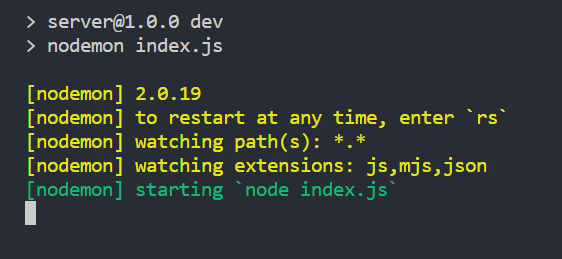

# React ve Nodejs ile TwinCAT HMI Arayüzü

Bu proje TwinCAT makine arayüzünün (HMI) kısmının React ve Nodejs kullanılarak oluşturulmuş bir örneğini içermektedir. Aşağıda adım adım projeyi nasıl başlatabileceğiniz anlatılmıştır.

## Proje Çalıştırma Ortamının Hazırlanması

Proje doyalarını indirip çalıştırmadan önce aşağıdaki linkteki kurumları gerçekleştirmiş olmanız gerekiyor. Adım adım nasıl kurulacağını bilmiyorsanız, linkler üzerindeki dökümanları okuyabilirsiniz.

1. <a href="https://www.beckhoff.com/tr-tr/support/download-finder/search-result/?download_group=97028248" target="_blank">TwinCAT Kurulumu</a>
2. <a href="https://www.beckhoff.com/tr-tr/products/automation/twincat/texxxx-twincat-3-engineering/te1000.html" target="_blank">Nodejs Ortamının Kurulumu</a> 
3. <a href="https://code.visualstudio.com/" target="_blank">İsteğe Bağlı VS Code Kod Editörü</a> (Farklı bir Code Editörü de kullanabilirsiniz)

Bu iki kurulumu gerçekleştirdikten sonra ufak bazı Nodejs ayarlaması yapmanız gerekiyor. Terminal ekranınızdan Nodejs ve NPM'in versiyonlarını kontorl ederek, versiyonlar sizde farklılık gösterebilir, doğru bir şekilde yüklendiğinden emin olun. 


## Proje Kodlarının Çalıştırılması ve Testi

GitHub üzerinden dosyaları local bilgisayarınıza kopyaladıktan sonra, aşağıdaki adımları takip ederek projeyi çalıştırabilirsiniz.

1. TwincatAdsClientConnection adlı TwinCAT projesini çalıştırın. Twincat Projesini çalıştırmak için BeckOFF'un resmi web sitesini ziyaret ederek adım adım bir TwinCAT projesinin nasıl çalıştırılabileceğini öğrenebilirsiniz.

``Önemli Not:`` projeyi doğru bir şekilde çalıştırabilmek için öncelikle <a href="https://www.npmjs.com/package/ads-client">ads-client</a> npm paketi dökümasyonunu inceleyin ve aşağıdaki kısım için gerekli olan konfigürasyonları gerçekleştirin:


2. Kod Editörünüzde client ve server dosyalarını açın

3. Kod editörünüzün terminal ekranını açın ve terminal komut satırınızda öncelikse server dosyasının içine girin. (```cd server```)

4. Proje için gerekli olan paketleri indirmek için ``npm install`` komutunu yazın ve çalıştırın.

```NOT:```Projeyi başlatabilmek için ayreten de nodemon modülünü global'e kurmanız gerekecektir.Bunun için npm i ``nodemon -g komutu`` ile nodemon paketini global'e kurabilirsiniz

5. Server için tüm paketler doğru bir şekilde yüklendikten sonra ``npm run dev`` komutu ile server'ı başlatın.



5. Server'ı ayağa kaldırdıktan sonra, faklı bir terminal ekranına geçiş yapın ve bu terminal ekranında da client dosyasına giriş yapın ( ``  cd client `` )

6. Client için gerekli modülleri indirmek için ```npm install``` komutunu kullanın.

7. Client için gerekli olan paketleri doğru bir şekilde yükledikten sonra client'ı çalıştırabilirsiniz. Bunun için terminal ekranına ```npm run dev``` komutunu yazın ve çalıştırın


Terminal ekranınızda yazan 5173 portlu URL uzantısına giderek projenin Web arayüzünü görebilirsiniz:


Projeniyi açtığınız anda, server sunucunuzda eğer şu şekilde bir çıktı alıyorsanız, proje düzgün bir şekilde çalışıyor demektir. Start butonuna tıklayaraktan makineyi başlatabilir ve projeyi çalışır halde görebilirsiniz:


Bu prjenin amacı, TwinCAT ortamında bir makinenin basınç değerlerini ölçen bir sistemi simüle etmek ve bu basınç değeri ile birlikte makine ortamında meydana gelen değişiklikleri bir Makine İnsan Arayüzü oluşturarak kullanıcılara aktarmaktır.

### Nodejs Kütüphanleri:
Projede yer alan package.json dosyası içerisinden hangi kütüphaneleri ve hangi versiyonlarını kullandığımızı öğrenebilirsiniz.

### Lisanslama:
Bu proje MIT lisanslamasına sahiptir.
